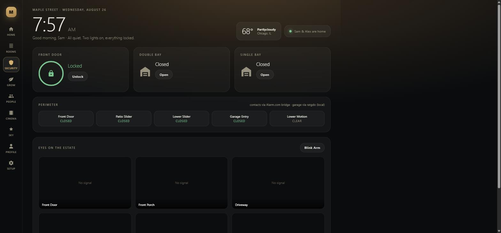
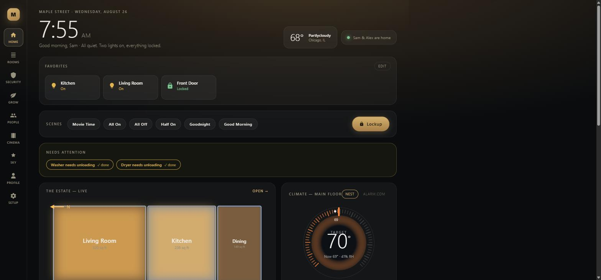
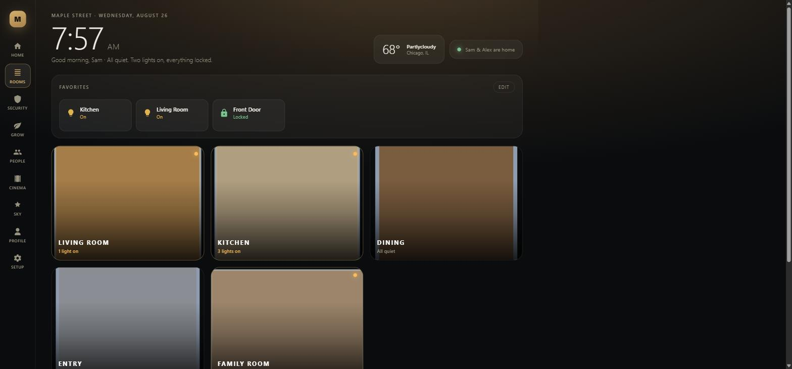
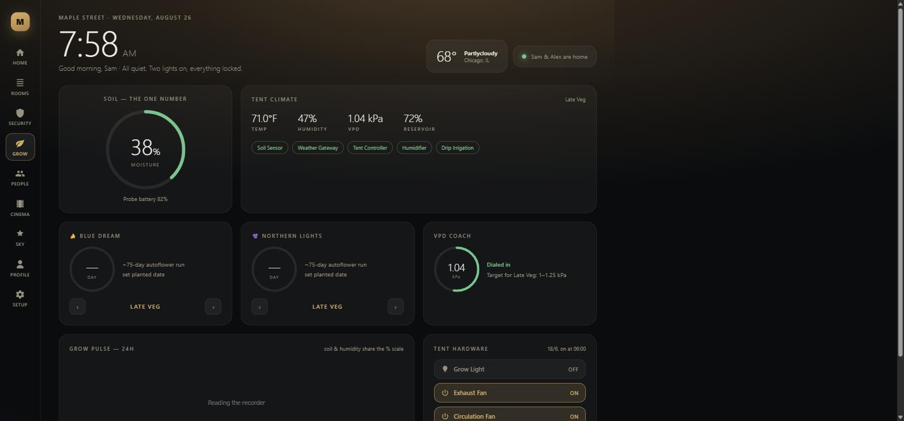

# 🏠 Self-Hosted Home Automation — Replacing alarm.com

A [Home Assistant](https://www.home-assistant.io/) setup built to **replace a paid
alarm.com subscription** with a self-hosted, locally-controlled smart home — no monthly
fee, no vendor lock-in, and automations that go well beyond what the subscription offered.
Security and monitoring lead; everything else (climate, shades, even an instrumented grow
tent) rides on the same local brain.

This repo carries two things:

1. **The Estate panel** — a full-screen React app that replaces the Lovelace dashboard for
   day-to-day use. Source in [`src/`](./src), and it is the reason this is a code repo
   rather than a write-up.
2. **The migration itself** — what got moved off the paid service, what it took, and what
   is still on it. That is the rest of this page.

> **Why this exists:** dropping the recurring monthly cost of a proprietary security
> service, and owning the whole stack instead of renting it. The same platform that
> watches the doors also runs the rest of the house.

> **Status: late migration.** The lock, both garage doors and the main thermostat are off
> the subscription and running on local radios or their own APIs. Door/window contacts are
> the last functional piece still bridged through it. This repo documents the cutover as
> it happens.

---

## 🎯 Goals of the migration

- **Kill the monthly fee** — replace a subscription with hardware that's paid for once.
- **Local control & privacy** — critical sensors run on the LAN, not a vendor cloud.
- **Do more, not less** — conditional alerts, cross-device automations, and dashboards a
  closed system can't offer.
- **One brain for the whole house** — security, climate, shades, and grow all in one place.

> ⚠️ **Honest note on monitoring:** a self-hosted setup like this is **self-monitored** by
> default — alerts go to your own devices, not a staffed monitoring center that dispatches
> emergency services. That's the right trade for many people (and the source of the
> savings), but it *is* a trade. If professional dispatch matters to you, some setups keep
> a slim monitored plan or add a third-party self-monitoring service alongside HA. Know
> which you're choosing.

---

## 📐 Architecture at a glance

```
                        ┌─────────────────────────────┐
                        │       Home Assistant         │
                        │   (Docker on a NAS via       │
                        │       Container Station)     │
                        │            + HACS            │
                        └──────────────┬───────────────┘
                                       │
   ┌──────────────┬──────────────┬─────┴────────┬──────────────┬──────────────┐
   │              │              │              │              │              │
┌──▼───────┐ ┌────▼─────┐ ┌──────▼──────┐ ┌─────▼─────┐ ┌──────▼─────┐ ┌──────▼─────┐
│ Contact  │ │ Cameras  │ │  Deadbolt   │ │  Garage   │ │  Shades    │ │ Grow tent  │
│ sensors  │ │+doorbell │ │  (Z-Wave)   │ │ (ESPHome  │ │ (Zigbee +  │ │ (sensors + │
│(bridged) │ │ (cloud)  │ │             │ │  on-board)│ │  BLE proxy)│ │  control)  │
└──────────┘ └──────────┘ └─────────────┘ └───────────┘ └────────────┘ └────────────┘
   SECURITY  ◄─────────────────────────────────────────►  COMFORT / CLIMATE / GROW
```

**Design principle — local first.** Safety- and security-critical signals run on **local**
integrations wherever possible, so a dropped internet connection never blinds the system.
Cloud integrations add convenience on top; they're never the only thing watching something
that matters. The garage doors are the clearest example: local controller boards replaced
cloud-bridged covers that lagged reality by up to 90 seconds and never reported the
*opening* and *closing* transitions at all.

---

## 🔐 Security & Monitoring (the core)

Replacing the paid service, piece by piece:

| Function | Device / method | Connection | Status |
|---|---|---|---|
| **Smart lock** | Z-Wave Plus deadbolt on the house's own controller | Local (Z-Wave) | ✅ Live |
| **Garage doors** | ESPHome controller board per opener, wired to the existing rail | Local (native API) | ✅ Live |
| **Cameras & doorbell** | Cloud camera system + video doorbell | Cloud | ✅ Live |
| **Smart notifications** | HA automations → phones, with per-person mute switches | Local logic | ✅ Live |
| **Nightly security sweep** | Automation at a configurable time, one-tap "run lockup" reply | Local logic | ✅ Live |
| **Entry detection** | Door/window contact sensors | Bridged (vendor) | 🔧 Last piece |
| **Alarm panel** | Legacy panel, **chime-only by household decision** | Bridged (vendor) | ⏸️ By choice |



**What HA does that the subscription didn't:**

- **Conditional alerts** instead of all-or-nothing — notify on doorbell press, suppress
  ordinary motion, and add presence/time conditions so you aren't pinged walking past your
  own door.
- **Alerts that outlive the event.** A laundry cycle ending is a notification; laundry
  *still sitting in the machine ninety minutes later* is the thing that actually needed
  saying. Standing flags, not fire-and-forget pushes.
- **Per-person subscriptions.** Each person owns six switches (security, grow, laundry,
  deliveries, sky, daily brief). Muting a category stops the push and nothing else — the
  house keeps tracking state either way.
- **Tap targets.** Every notification carries a deep link to the panel page that explains
  it, so a push is the beginning of an action rather than a dead end.
- **No per-month cost** for any of it.

---

## 🖥️ The Estate panel



A React app registered as a Home Assistant panel — a full-screen surface, not a card. It
exists because Lovelace's grid stops being the right tool once a dashboard becomes the
thing the household actually looks at.

| Page | What it's for |
|---|---|
| **Home** | The one-screen answer: who's home, what's unlocked, weather, scenes, favourites |
| **Rooms** | Favourites, then a tile per room — tap one for what's in it |
| **Security** | Perimeter board: every door, both garages, the lock, cameras |
| **Grow** | Tent climate, VPD, soil, per-plant stage tracking |
| **Sky** | ISS passes, aurora, launches, moon phase, NASA imagery |
| **Cinema** | TV, receiver and speaker control |
| **People** | Presence for the household — and honestly, which phones aren't linked yet |
| **Profile** | Your own notification switches and the household's saved locations |
| **Setup** | House-wide thresholds and schedules — administrators only |

Pages are addressable by URL hash (`#security`, `#grow`, …), which is what lets a
notification deep-link to the page that explains it.



**A room tile has to earn its place.** Rooms whose only contents are read-only sensors are
readouts, not destinations — tapping one did nothing — so they are filtered out by domain
rather than by a hand-kept list, and a room reappears on its own the moment you wire
something controllable into it. Rooms that *are* controllable but belong to another page
(garage bays, the alarm panel) carry a `hideFromRooms` flag instead. Neither filter touches
the floorplan: every room stays on the map.

### Why React, on a platform that isn't

Home Assistant's frontend is Lit web components. A React app can still host HA's own
`hui-*` cards as custom elements, which is what makes "your components *and* the built-in
ones" possible rather than a rewrite of everything.

Three decisions carry the weight:

- **No shadow DOM** ([`src/main.tsx`](./src/main.tsx)) — HA's theme CSS variables cascade
  in, so the panel inherits the user's theme for free.
- **Selective subscription** ([`src/ha/useEntities.ts`](./src/ha/useEntities.ts)) — the
  `hass` object changes identity on *every* state update in the house. Components that read
  it directly re-render constantly; on a wall tablet that is the difference between smooth
  and unusable. Components name the entities they need and re-render only for those.
- **The unstable API lives in one file** ([`src/ha/HaCard.tsx`](./src/ha/HaCard.tsx)) —
  `loadCardHelpers()` is not a public API. It is confined to a single module so an HA
  release can only break one file.

Two hard-won gotchas are worth repeating for anyone building gesture UI here: keep drag
state in a `useRef`, not `useState` (a fast drag delivers many pointer events inside one
React tick, and batched state hands every one the same stale base), and debounce commands
to cloud APIs — see the thermostat note under Climate.

> **About the screenshots.** Every one is the **sample house** — invented rooms, invented
> people, invented entity ids — captured from the offline harness described below. None of
> them show a real home's devices, family or floorplan, which is the same reason the
> committed config is sample data.

### The house config — and why nothing here names a real device

Every entity id, person, room and floorplan lives in one config object
([`src/house/`](./src/house)). Components read the config; they never name an entity
themselves.

- **`sample.ts` is what ships** — invented ids, an invented family, a plain rectangular
  floorplan. A fresh clone builds and runs against it.
- **`local.ts` is what runs in a real house** — git-ignored, and it wins automatically when
  present.

Copy the sample to `local.ts`, edit the ids to match your Home Assistant, and every page
follows. Anything left pointing at a sample id renders as unavailable: the panel degrades
card by card rather than failing whole.

📄 **Setup steps:** [INSTALL.md](./INSTALL.md).

---

## 🪟 Comfort & Climate

| Function | Device / method | Connection | Status |
|---|---|---|---|
| **Thermostat (main floor)** | Smart thermostat over the vendor's device API | Cloud (OAuth) | ✅ Live |
| **Thermostat (lower level)** | Legacy stat | Bridged (vendor) | 🔧 Migrating |
| **Lighting** | Wired dimmers + smart bulbs, with adaptive colour/brightness | Local | ✅ Live |
| **Motorized shades** | Yoolax — three Bluetooth (Tuya BLE), four Zigbee | Local (both) | 🔧 In progress |

Two notes worth stealing:

- **Adaptive lighting is split by hardware.** Bulbs that support colour temperature adapt
  colour *and* brightness; brightness-only dimmers adapt brightness. Adapting a group *and*
  its member bulbs makes the two fight each other — members only.
- **Thermostat APIs rate-limit per user, not per app.** Sending a command on every tap of a
  stepper earns a `429` in seconds. Both thermostat surfaces in this project hold a local
  draft and send only the settled value after a ~900 ms quiet period.

See the [Yoolax shades spotlight](#-spotlight-yoolax-shades--bluetooth-and-zigbee) below —
the same product line ships on two different radios, and it matters.

---

## 🌱 Grow Tent (one room, fully instrumented)

One of the rooms this stack watches is an indoor grow tent — a good stress-test for the
"never be blind to a failure" philosophy, since a missed problem there has a real cost.

> A previous grow was set back when a device came unplugged and a pot dried out for six
> days unnoticed. The grow-tent instrumentation exists so that can't happen silently again.

| Function | Device / method | Connection | Status |
|---|---|---|---|
| **Soil moisture** ⭐ | Soil probe over local polling | Local | ✅ Live |
| **Tent climate + device control** | Tent controller, humidifier, drip | Cloud | ✅ Live |
| **Environment/weather** | Weather gateway + outdoor station | Local | ✅ Live |
| **VPD** | Computed from tent temp/humidity with a leaf offset | Derived | ✅ Live |



The soil-moisture probe runs on a **fully local** integration so the dry-out alarm works
even if the internet is down — the single most safety-critical sensor in the whole house,
by this project's logic.

**VPD is the number that matters, and most calculators get it wrong.** Vapour pressure
deficit governs how hard a plant has to work to drink, which is why "humidity is 73%" is
not actionable and "VPD 0.36 kPa" is. The catch: VPD is a property of the *leaf*, not the
air, and under LED a leaf sits about 2 °C cooler than the air around it. Computing
saturation pressure at air temperature overstates VPD by roughly 0.2–0.3 kPa — the entire
width of a target band.

---

## 🔌 Integrations & Repositories

| Integration | Source | Connection | Status |
|---|---|---|---|
| **HACS** | [hacs.xyz](https://hacs.xyz) | — | ✅ Live |
| **Z-Wave JS** (deadbolt) | Home Assistant core + USB coordinator | Local (Z-Wave) | ✅ Live |
| **ESPHome** (garage doors) | Home Assistant core | Local (native API) | ✅ Live |
| **Cameras / doorbell** | Home Assistant core | Cloud | ✅ Live |
| **Thermostat** | Home Assistant core, vendor device API | Cloud (OAuth + Pub/Sub) | ✅ Live |
| **Adaptive Lighting** | HACS | Local | ✅ Live |
| **Soil / environment** | HACS, local LAN polling | Local | ✅ Live |
| **Tent controller** | HACS (vendor API) | Cloud | ✅ Live |
| **ZHA** (Zigbee shades) | Home Assistant core + USB coordinator | Local (Zigbee) | ✅ Coordinator live |
| **Bluetooth** (BLE shades) | ESPHome Bluetooth Proxy on an ESP32 | Local | ✅ Live |
| **Tuya BLE** (BLE shade control) | HACS, needs per-device local keys | Local | 🔧 In progress |
| **Contact sensors** | (radio depends on sensor type) | Bridged today | 🔧 Migrating |

📄 **Full setup steps:** see [INSTALL.md](./INSTALL.md) for how the platform and each
integration are configured from scratch, plus hosting options for people not on a NAS.

---

## 🤖 Automations (design intent)

| Automation | Trigger | Purpose |
|---|---|---|
| **Smart door alerts** | Doorbell press, or a contact opening while away | Signal instead of motion spam |
| **Nightly security sweep** | Clock, at a configurable time | One check that's silent when everything's locked |
| **Garage left open** | A door open longer than a configurable threshold | The failure everyone actually has |
| **Dry-pot alarm** ⭐ | Soil moisture below threshold, sustained | Catch a dry-out in an hour, not six days |
| **Device-offline alert** | A critical device unavailable for 5 minutes | Catch the "unplugged" failure automatically |
| **VPD out of band** | Sustained an hour outside the stage's target | One push, not one per excursion |
| **Laundry still waiting** | Standing flag, 90 minutes after a cycle ends | The alert that outlives the machine |

Two rules run through all of them: **a push has to earn the interruption**, and **muting an
alert must never stop the house from tracking the underlying state**.

*Automations layer on top of vendor apps, never in place of them — each critical value has
more than one thing watching it.*

---

## 🪟 Spotlight: Yoolax shades — Bluetooth *and* Zigbee

Window automation here runs on **Yoolax motorized shades**, and it ended up spanning two
radios rather than one. That was not the plan, and the reason is worth writing down.

| | Three already hung | Four to come |
|---|---|---|
| **Radio** | Bluetooth LE | Zigbee |
| **Stack** | Tuya BLE (Yoolax is a Tuya white-label) | Standard Zigbee, joins ZHA directly |
| **Reaches HA via** | An ESP32 Bluetooth proxy | A USB Zigbee coordinator |
| **Status** | 🔧 Identified, control in progress | 🔧 Coordinator live, awaiting hardware |

**Neither vendor page will tell you which one you are buying.** The three that went up
first turned out to be BLE, and nothing in the listing said so. What settled it was putting
an ESP32 Bluetooth proxy in the room and reading what the motors actually advertise:

```
DC:23:53:9C:FF:BC   name "TY"   service fd50   manufacturer 0x07D0   connectable
DC:23:53:9D:04:2F                service fd50                        connectable
DC:23:53:9D:05:14                service fd50                        connectable
```

Service UUID `fd50` and company ID `0x07D0` are both **Tuya**, and one of them broadcasts
the name `TY` outright. Three devices, one vendor prefix, three blinds. Identification
took ten minutes once there was a Bluetooth radio in the house at all — and there had
never been one before, which is the real reason this took weeks.

**What each path needs:**

- **Zigbee** — a USB coordinator and ZHA. Devices join directly; no vendor hub, no cloud.
  The coordinator here came up on `ezsp` firmware and formed a network in one pass.
- **Tuya BLE** — HA's Bluetooth stack plus a proxy for range, and the **local key** for
  each device, which only comes from a free Tuya IoT Platform account linked to whichever
  app the blinds are paired in. Note that the *official* Tuya cloud integration is no help
  here: a BLE-only motor is not cloud-reachable without a Tuya gateway.

**The buying lesson, stated plainly:** shades that speak **standard Zigbee** drop into an
open stack and are done. Shades that speak **Tuya BLE** work, but only after a proxy, a
developer account and a key extraction — for the same money and the same-looking product.
If you are choosing today, ask the vendor which radio ships in the box and do not accept
"smart" as an answer.

**One more hardware note, since it cost three days.** A coordinator advertising both Zigbee
and Thread runs one *or* the other depending on the firmware flashed — not both at once.

---

## 🗺️ Roadmap

- [x] Home Assistant on a NAS (Docker) + HACS
- [x] Cameras/doorbell — live
- [x] Grow-tent monitoring (soil + climate + VPD) — live
- [x] Deadbolt on the house's own Z-Wave controller
- [x] Both garage doors on local ESPHome boards
- [x] Main thermostat off the subscription bridge
- [x] React panel with a real design system + live floorplan
- [x] Per-person notification preferences and notification deep links
- [x] Nightly backups with retention
- [ ] Door/window contact sensors — finish migration off the paid service
- [x] Zigbee coordinator live, network formed
- [x] Bluetooth reaches the house at all — ESP32 proxy, HA's first BLE radio
- [x] The three hung shades identified as Tuya BLE
- [ ] Tuya BLE local keys, so those three can be driven
- [ ] Zigbee shades: pair, group, schedule
- [ ] Off-device backup copy
- [ ] Decommission the paid subscription

---

## ⚠️ Notes & Disclaimers

- This is a **self-monitored** setup by default (see the note up top). It is not a
  substitute for professionally-monitored security unless you deliberately add that.
- Several integrations are **community-maintained and unofficial** — used here for
  monitoring and convenience, with vendor apps retained as safety nets for anything
  critical. Treat community integrations as tinker-grade, not appliance-grade.
- Software versions and steps move quickly — check each linked repo's current README
  before installing.
- This repository is intentionally **generic**: no addresses, network details, serial
  numbers, account identifiers, tokens or location data. The committed house config is
  sample data; the real one is git-ignored. If you fork this for your own house, keep it
  that way — `src/house/local.ts` should never be committed.

---

*Built by a hands-on maker replacing rented security with something owned, local, and more
capable — one room (and one subscription line item) at a time.*
